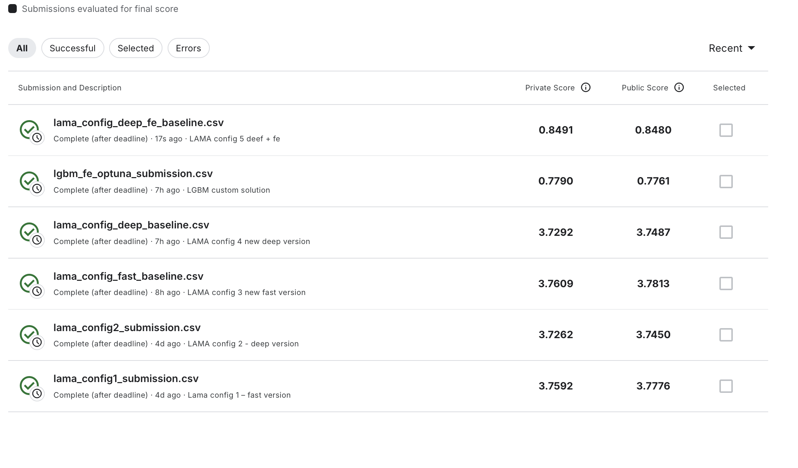

# Ventilator Pressure Prediction

Решение соревнования [Google Brain - Ventilator Pressure Prediction](https://www.kaggle.com/competitions/ventilator-pressure-prediction) с использованием Light AutoML и custom подходов.

## Описание задачи

**Цель:** Предсказать давление в дыхательных путях пациента во время механической вентиляции легких.

Механическая вентиляция легких - ресурсоемкая процедура, что особенно проявилось во время пандемии COVID-19. Разработка новых методов управления вентиляторами требует дорогостоящих клинических испытаний. Качественные симуляторы могут значительно снизить этот барьер.

**Входные параметры:**
- **R** - сопротивление дыхательных путей (5, 20, 50 cmH2O/L/S)
- **C** - растяжимость легких (10, 20, 50 mL/cmH2O)
- **time_step** - временная метка в цикле дыхания
- **u_in** - управляющий сигнал клапана вдоха (0-100)
- **u_out** - управляющий сигнал клапана выдоха (0 или 1)

**Целевая переменная:** `pressure` - давление в дыхательных путях (cmH2O)

**Метрика качества:** Mean Absolute Error (MAE) на фазе вдоха

$$
\text{MAE} = \frac{1}{n} \sum_{i=1}^{n} |y_i - \hat{y}_i|
$$

---

## Структура проекта

```
ventilator-pressure-prediction/
├── data/                      # Данные соревнования (train.csv, test.csv)
├── picture/                   # Скриншоты с Kaggle Leaderboard
├── submissions/               # CSV файлы для отправки на Kaggle
├── eda.ipynb                  # Исследовательский анализ данных
├── lama.ipynb                 # Эксперименты с Light AutoML (5 конфигураций)
├── custom_solution.ipynb      # Custom решение (LightGBM + Optuna)
├── pyproject.toml             # Зависимости (Poetry)
└── README.md                  # Этот файл
```

---

## Подход к решению

### 1. EDA

**Ключевые находки:**
- **Структура**: данные представляют циклы дыхания (breath_id), каждый из 80 шагов
- **Целевая переменная**: сильная правая асимметрия (skew=1.82), 9.85% выбросов (но по заданию они таковыми не являются, все в пределах нормы)
- **Корреляции**:
  - `u_out` (-0.61) - сильнейшая связь с давлением
  - `time_step` (-0.52) - временная зависимость
  - `u_in` (+0.31) - управление впускным клапаном
  - Внутри циклов корреляции в 2-3 раза сильнее
- **Пропуски**: отсутствуют во всех признаках

### 2. Feature Engineering

Созданы дополнительные признаки на основе анализа:

| Признак | Описание | Обоснование |
|---------|----------|-------------|
| `u_in_lag_1/2/3` | Предыдущие значения управляющего сигнала | Корреляция внутри циклов в 2-3 раза сильнее |
| `u_in_diff` | Скорость изменения управляющего сигнала | Динамика изменений критична для временных моделей |
| `u_in_cumsum` | Накопленный объем воздуха | Физический смысл - интеграл потока |
| `R_x_C` | Произведение параметров легких | Нелинейное влияние комбинаций R×C |
| `time_position` | Порядковый номер шага в цикле (0-79) | Определение фазы дыхания |

---

## Эксперименты и результаты

### LAMA Baseline (5 конфигураций)

| Конфигурация | Timeout | Признаки | Алгоритмы | Public Score | Private Score |
|--------------|---------|----------|-----------|--------------|---------------|
| Config 1: Fast + split | 300s | Базовые (5) | LightGBM | 3.7776 | 3.7592 |
| Config 2: Deep + split | 1800s | Базовые (5) | LGBM + CatBoost | 3.7450 | 3.7262 |
| Config 3: Fast | 300s | Базовые (5) | LightGBM | 3.7813 | 3.7609 |
| Config 4: Deep | 1800s | Базовые (5) | LGBM + CatBoost | 3.7487 | 3.7292 |
| **Config 5: Deep + FE** | **1800s** | **Базовые + FE (12)** | **LGBM + CatBoost** | **0.8480** | **0.8491** |

**Ключевой инсайт:** Feature Engineering дал улучшение более чем в **4 раза** (с 3.74 до 0.85 MAE)!

### Custom Solution

**Подход:** LightGBM + Feature Engineering + Optuna (гиперпараметры)

**Оптимизируемые параметры:**
- `learning_rate`: 0.01 - 0.1
- `num_leaves`: 31 - 128
- `subsample`: 0.6 - 1.0
- `colsample_bytree`: 0.6 - 1.0

**Результат:** Лучшая модель с параметрами из 15 trials Optuna

---

## Итоговые результаты

**Лучшая модель:** LAMA Deep + Feature Engineering

| Метрика | Значение |
|---------|----------|
| **Kaggle Public Score** | **0.8480** |
| **Kaggle Private Score** | **0.8491** |
| Алгоритм | LightGBM (5-fold ensemble) |
| Признаков | 12 (5 базовых + 7 FE) |

**Скриншот всех решений на Kaggle:**



---

## Установка и запуск

### Требования
- Python 3.11+
- Poetry

### Установка зависимостей

```bash
poetry install
```

### Загрузка данных

Скачайте данные со страницы соревнования: https://www.kaggle.com/competitions/ventilator-pressure-prediction/data

Разместите файлы в папке `data/`:
- `train.csv`
- `test.csv`
- `sample_submission.csv`

### Запуск экспериментов

1. **EDA**: откройте `eda.ipynb` для анализа данных
2. **LAMA baseline**: запустите `lama.ipynb` для воспроизведения 5 конфигураций
3. **Custom solution**: запустите `custom_solution.ipynb` для LightGBM + Optuna

---

## Выводы и инсайты

1. **Feature Engineering критичен**: добавление lag-признаков и взаимодействий R×C улучшило результат в 4 раза
2. **Временная структура важна**: использование GroupKFold по breath_id предотвращает утечку данных
3. **LAMA эффективен**: даже базовый LAMA показывает приемлемые результаты (MAE ~3.7)
4. **Физический смысл признаков**: признаки с физическим обоснованием (u_in_cumsum, R_x_C) показывают лучшие результаты

---

## Ссылки

- [Соревнование на Kaggle](https://www.kaggle.com/competitions/ventilator-pressure-prediction)